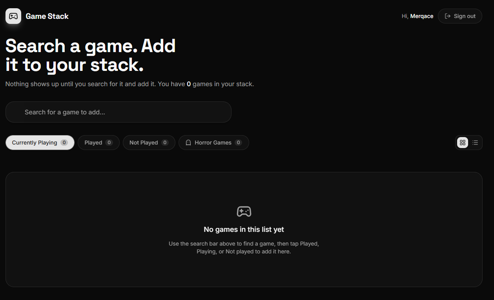
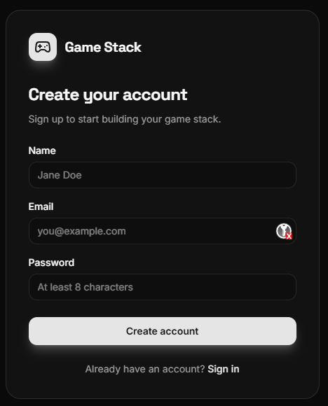
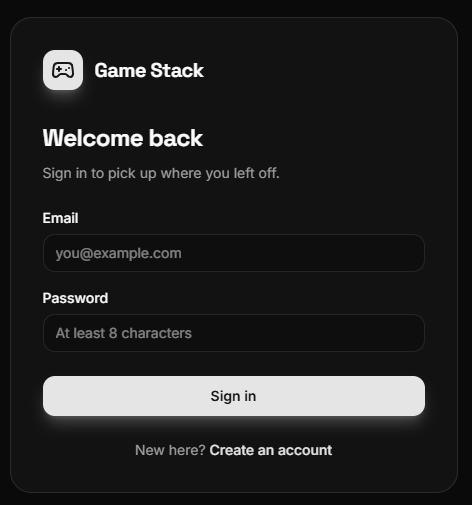
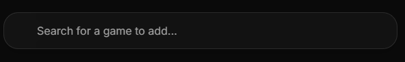
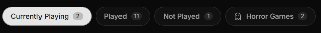
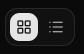

# 🎮 Game Stack

> A minimal, dark-mode dashboard designed to track your gaming library. Keep tabs on what you are **currently playing**, organize your backlog, and catalog your favorite **horror collections** in one clean workspace.

---

## 📸 App Preview

<p align="center">
  
</p>

---

## ⚡ Core Features

### 🔐 Account Pages
> Sign up or log in within seconds. Your personal game library safely syncs across sessions.

<br />

<p align="center">
  
  &nbsp;&nbsp;
  
</p>

*   **Quick Onboarding:** Fast account creation inputs.
*   **Secure Access:** Clean login wrapper powered by Better Auth.

---

### 🔍 Search Bar
> Find any game you want to add by typing its name in the search bar.

<br />

<p align="center">
  
</p>

*   **Instant Querying:** Results appear dynamically as you type.
*   **One-Click Add:** Seamlessly pull game data into your personal lists.

---

### 🗂️ Order Your Games
> Organize your titles into quick, accessible categories based on your progression.

<br />

<p align="center">
  
</p>

*   **Status Tabbing:** Instantly toggle between **Currently Playing**, **Played**, or **Not Played**.
*   **👻 Horror Spotlight:** A dedicated custom counter built specifically to isolate your survival horror library.

---

### 🎛️ Grid & List View
> Swap the interface layout instantly to match your preference.

<br />

<p align="center">
  
</p>

*   **Visual Grid:** Showcases massive, high-fidelity cover art cards.
*   **Scannable List:** A compressed layout perfect for managing large backlogs.

---

## 🛠️ Built With


---

## 🚀 How to Run Locally

1. **Clone the repo and install packages:**
   ```bash
   git clone [https://github.com/YOUR_USERNAME/game-stack.git](https://github.com/YOUR_USERNAME/game-stack.git)
   cd game-stack
   pnpm install
